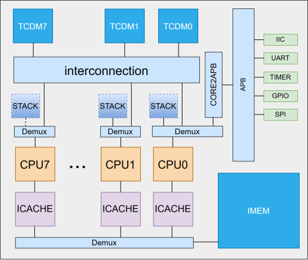

RISC-V (pronounced "risk-five") is an open standard instruction set architecture (ISA) based on established reduced instruction set computing (RISC) principles. Unlike proprietary ISAs, the RISC-V ISA is provided under open source licenses that do not require fees to use. This openness allows any organization or individual to design, manufacture, and sell RISC-V chips and software without paying royalties.

# Research
Our research implies RISC-V on multi-core interconnection, processor soft error resilience strategy, and general network processor architecture. 

We designed the **interconnection structure and programming framework** for multi-core RISC-V architecture in edge computing scenarios, and implemented a complete runnable prototype of a multi-core processor. This project was sponsored by Nanjing Qinheng Microelectronics.

---
We explored **processor soft error resilience strategy**, and proposed a set of soft error detection and recovery mechanisms in a RISC-V in-order single-core processor.This innovation significantly improved the soft error reslience with reasonable performance and resource overhead. This work has resulted in a patent, and we plan to publish a paper. We continued our collaboration with Qinheng.

---
Currently, we are collaborating with Sanechips to implement the RISC-V instruction set in a **network processor**, and propose a new network processor instruction set based on RISC-V later.

# Collaborating Companies

