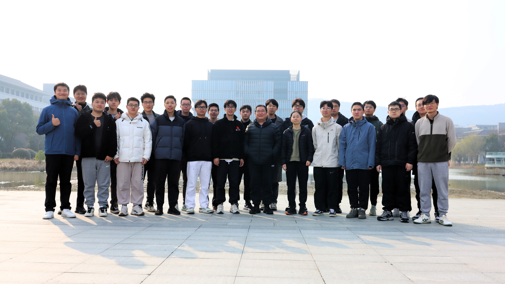

  <h1>Welcome to ECAS!</h1>
  

 

**ECAS (Embedded Computing Architecture and Systems)** Group belongs to **Ming Ling**（凌明）, [School of Intergrated Circuits](https://ic.seu.edu.cn), Southeast University, China. Group members are working on 3 areas: 

[Vina](https://ecas-ling.github.io/Vina/)  
[Quantitative Analysis](https://ecas-ling.github.io/Quant/)  
[RISC-V](https://ecas-ling.github.io/RISC-V/)

👨‍🏫 Personal Introduction
======
Ming Ling (Member, IEEE) is a Professor and Phd Advisor of **The National ASIC System Engineering Technology Research Center**, Southeast University, and he is also the Director of Electrical and Electronic Experiment Center. His current research interests include *memory subsystem of system-on-chip (SoC), processor architecture, and domain-specific architecture*.  

Ming Ling received his B.S., M.S. and Ph.D. degrees from Southeast University in 1994, 2001 and 2011 respectively. His advisor is Longxing Shi. From 2013 to 2014, he was a visiting scholar at School of Computer Science, University of Victoria, Canada.

🔥News
======
- *2025.11*: &nbsp;🎉🎉 Two papers are accepted in [*DATE'26*](https://www.date-conference.com/)!
- *2025.11*: &nbsp;🎉🎉 Our team won the Gold Award at [The 2nd Global Digital Intelligience Education Innovation Competition](https://www.bohrium.com/competitions/2625276900?tab=introduce)!
- *2025.09*: &nbsp;🎉🎉 **Diff-DiT** has been selected as the  [Best Paper Award Candidate](https://confcats-event-sessions.s3.us-east-1.amazonaws.com/iccad25/uploads/ICCAD_2025_Program_v20.pdf)  in *ICCAD'25*!
- *2025.07*: &nbsp;🎉🎉 One paper accepted in [*ICCAD'25*](https://2025.iccad.com/)!
- *2025.05*: &nbsp;🎉🎉 One paper accepted in [*ACM Transactions on Embedded Computing Systems*]((https://dl.acm.org/doi/abs/10.1145/3728470))!
- *2025.05*: &nbsp;🎉🎉 Two papers accepted in [*GLVLSI'25*](https://www.glsvlsi.org/)!

<!-- Selected Publications
====== -->

👨‍👩‍👧‍👦 Research Team
===

> *Last edited in 2024.10*