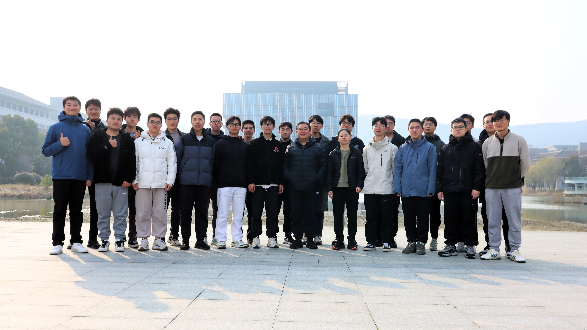

  <h1>Welcome to ECAS!</h1>
  

 

**ECAS (Embedded Computing Architecture and Systems)** Group belongs to **Ming Ling**（凌明）, [School of Intergrated Circuits](https://ic.seu.edu.cn), Southeast University, China. Group members are working on 3 areas: 

[Vina](https://ecas-ling.github.io/Vina/)  
[Quantitative Analysis](https://ecas-ling.github.io/Quant/)  
[RISC-V](https://ecas-ling.github.io/RISC-V/)

👨‍🏫 Personal Introduction
======
Ming Ling (Member, IEEE) is a Professor and Phd Advisor of **The National ASIC System Engineering Technology Research Center**, Southeast University, and he is also the Director of Electrical and Electronic Experiment Center. His current research interests include *memory subsystem of system-on-chip (SoC), processor architecture, and domain-specific architecture*.  

Ming Ling received his B.S., M.S. and Ph.D. degrees from Southeast University in 1994, 2001 and 2011 respectively. His advisor is Longxing Shi. From 2013 to 2014, he was a visiting scholar at School of Computer Science, University of Victoria, Canada.

🔥News
======
- *2026.5*: &nbsp;🎉🎉 Congradulations on the 2026 Excellent Master Thesis Award, Southeast University, which won by Mr. Rui Liu
- *2026.3*: &nbsp;🎉🎉 [*BenDan: Benchmarking DPU performance on FPGAs*](https://www.sciencedirect.com/science/article/pii/S0167926026000507) is accepeted in Integration!
- *2026.3*: &nbsp;🎉🎉 Two papaers are accepted in [*ISEDA'26*](https://www.eda2.com/iseda/index.html)!
- *2026.1*: &nbsp;🎉🎉 [*FP8ApproxLib: An FPGA-based approximate multiplier library for 8-bit floating point*](https://www.sciencedirect.com/science/article/pii/S1383762126000044) is accepeted in Journal of Systems Architecture!
- *2025.12*: &nbsp;🎉🎉 [*Hessian-driven N:M sparsity and quantization co-optimization for edge device deployment*](https://www.sciencedirect.com/science/article/pii/S016792602500286X) is accepeted in Integration!
<!-- Selected Publications
====== -->

👨‍👩‍👧‍👦 Research Team
===

> *Last edited in 2024.10*