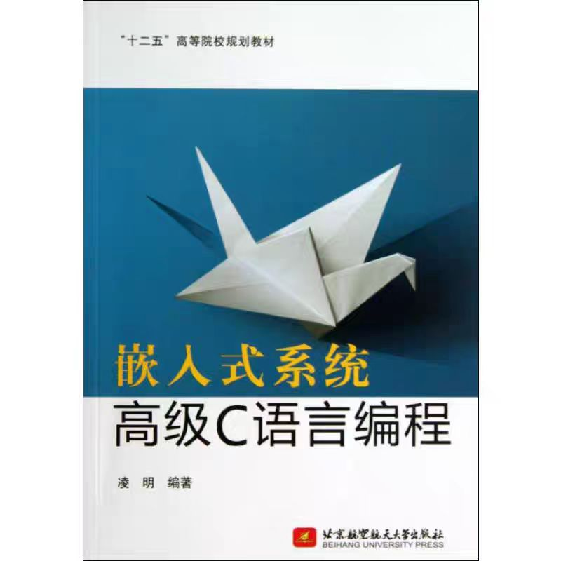

# Courses
### Introduction of Embedded Systems
- Senior undergraduates
- 2008 - 

### Design of Embedded Systems
- Graduates
- 2005 - 

### Premier C Programming of Embedded Systems
- Graduates
- 2010 - 2013

# Books
### Embedded Systems - From SOC chip to System (Second Edition)
- **Ming Ling**, Xuexiang Wang, Weiwei Shan
- 2017
- Publication House of Electronics Industry
  
    
 

### Premier C Programming of Embedded Systems
- **Ming Ling**
- 2011
- Beihang University Press
  
    
 

### Embedded system design with Xuantie 802/803 Micro Processor Core
- Rui Zhong, **Ming Ling**, Zhijian Chen
- 2020
- Southeast University Press

### Embedded Systems - Applications Development with SEP3203 Micro Processor
- Longxing Shi, **Ming ling**, Xuexiang Wang
- 2006
- Publication House of Electronics Industry

